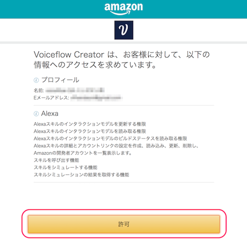
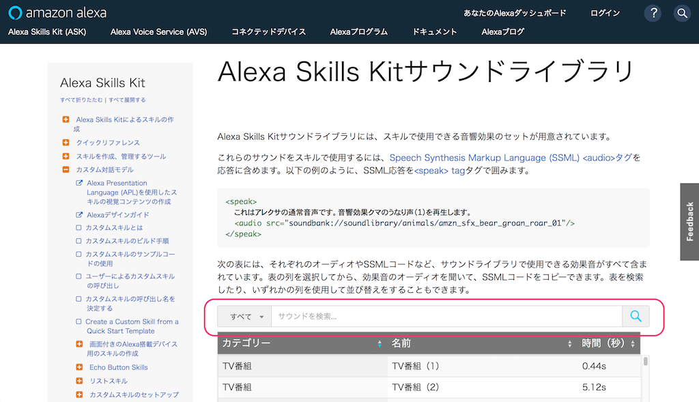
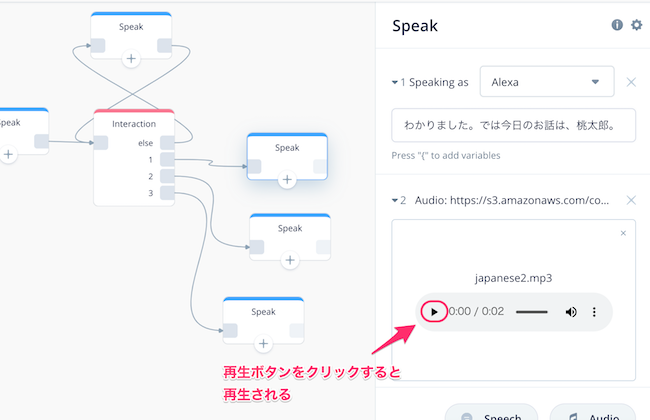

# Voiceflowハンズオン＆ワークショップ：インタラクティブな物語スキルを作ろう

## 概要

### はじめに


本資料は、「Voiceflowハンズオン＆ワークショップ：インタラクティブな物語スキルを作ろう」のハンズオン用資料になります。

アカウントのセットアップなど事前準備は以下をご覧ください。

- Voiceflowハンズオン: アカウントのセットアップ手順
[https://vf-handson-setup.netlify.com/#0](https://vf-handson-setup.netlify.com/#0) 

### 注意

Negative
: 本手順書は2019年11月21日時点のものですが、Voiceflowの開発はかなり活発なので、本手順書通りに進めてもうまくいかない場合や画面が変更されている場合があります。ご容赦ください。（必要な場合は補足します）

Positive
: 不具合やお気づきの点があれば、[https://github.com/kun432/voiceflow-handson-story/issues](https://github.com/kun432/voiceflow-handson-story/issues)でissue立てていただければと思います。PRも歓迎！

Positive
: 不具合やお気づきの点があれば、kun432.8d1w@gmail.comまで。

### 更新履歴

- 2019/11/21    公開

ではNextをクリックしてください

## プロジェクトの作成と基本操作

### プロジェクトの作成

最初にプロジェクトを作成して、かんたんにVoiceflowの画面の説明を行います。

以下のURLにアクセスしてください。
[https://voiceflow.com/](https://voiceflow.com/)

右上の"Log in"をクリック。


アカウント作成した際のメールアドレスとパスワードを入力して"Sign in"をクリックします。


プロジェクトの一覧画面が表示されます。Default Listと書いてあるところの一番下の"Create Project"をクリックします。


プロジェクト作成画面が開きますので、以下の通り設定して、最後に"Create Project"をクリックします。

- プロジェクト名
  - 今回は「世界の音絵本」と入力してください。
  - スキルを呼び出すときのデフォルトの名前になります。（例：「アレクサ、◯◯◯を開いて」）
  - 後でプロジェクト名と呼び出し名のそれぞれを変更することも可能です。

- 言語: "English(US)"のチェックを外して、"Japanese(JP)"にチェック


プロジェクトが作成されると"Canvas"画面が表示されます。"Canvas"画面がVoiceflowでスキルを作成する基本画面になります。

- 最初から用意してあるHome Blockの中にあるStartがスタート地点になります。
- 左のBlocksメニューにいろんな機能のBlockが用意されています。ここからBlockを選択してCANVAS上に配置します。
- CANVASに配置したBlockの設定を行い、アレクサに発話させたり、ユーザの発話を受け取ったりします。
- Block同士を線でつなげることで、会話の流れがつながっていきます。
- アップロードボタンをクリックすると、作成したプロジェクトがAlexa開発者コンソールにアップロードされ、Amazon Echoなどで呼び出せるようになります。
- Blocksメニュー以外にもいくつか別のメニューがありますが、後で説明します。


では早速やってみましょう。

### CANVASとBlockの使い方

Voiceflowでは、いろんな機能を持ったBlockをCanvasに配置して線をつなぐことで、会話の流れを作ることになります。試しに少しやってみましょう。

左のBlocksメニューの一番上にある"Speak"というブロックを、最初から配置してあるHome Blockの右側あたりにドラッグ＆ドロップで配置してください。すると、画面の右側に別の設定画面が出てくると思います。


この設定画面の右上の入力欄に以下と入力してみてください。

```
世界の音絵本にようこそ。このスキルでは、世界の有名な童話を楽しくお話します。
```


そして、Home BlockのStartの右端からSpeak Blockの左端までドラッグしながら線でつなげます。


はい、これが基本的な操作になります。かんたんですよね？おさらいでもう一つSpeak Blockをつなげてみましょう。

- 最初に配置したSpeak Blockの右側にもう一つSpeak Blockを配置します。
- Speak Blockの設定画面の入力欄に以下を入力します
```桃太郎、シンデレラ、ガリバーの冒険、のどれを聞きたいですか？```
- Speak Block同士を線でつなげます。


２回目なのでもう大丈夫ですよね。ちなみに、線を引き直したい場合は、線の始点側のブロックの四角をクリックするか、線の真ん中にカーソルを合わせると表示されるバケツアイコンをクリックすると消せます。


では作ったスキルを実際に動かしてみたいと思います。

### スキルのアップロードとテスト

作成したスキルを動かすにはAlexa開発者コンソールへのアップロードが必要です。右上の"Upload to Alexa"というボタンをクリックしてください。


初回に限り、VoiceflowアカウントとAlexa開発者アカウントの紐付けが必要になります。"Connect Amazon"ボタンをクリックしてください。


Amazonアカウントのログイン画面が出てきますので、お持ちのAmazonアカウントでログインします。


VoiceflowからAmazonアカウント経由でAlexaスキル作成等の許可を求める画面が出てきますので、「許可」をクリックします。これでアカウントの紐付けは完了です。



アップロードが行われます。100%になるまで待ちます。


100％になって"Upload Successful"と表示されればアップロード完了です。ではAlexa開発者コンソールでテストしましょう。"Test on Alexa Simulator"をクリックしてください。


Alexa開発者コンソールのログイン画面が表示されたら、Amazonアカウントでログインしてください。


Alexa開発者コンソールのテストシミュレータ画面が表示されます。作成したスキルはここでほぼ実機と同じようにテストができます。


なお、この時、左上のところで「非公開」が選択されていた場合は「開発中」に変更します。


テストは文字だけでなく音声でも行なえます。まず最初にマイクを有効にしておきましょう。「許可」をクリックします。


ではいよいよテストです。「日本語」が選択されていることを確認して、マイクアイコンをクリックしたままマイクに「音絵本を開いて」と話しかけて、話し終わったら話してみてください。パソコンにマイクがない場合は、キーボードから入力してENTERキーを押してください。


あなたの発話に対して、Voiceflowで設定した内容をAlexaが返してくれればテストは成功です！これでスキル開発の第一歩を踏み出したことになります！おめでとうございます！


このように、Voiceflowでスキルを作成 → Alexa開発者コンソールにアップロード → Alexa開発者コンソールでテスト、というのがVoiceflowでのスキル開発の流れになります。どうでしょうか？そんなに難しくないですよね？この調子で続けていきましょう！

"Next"をクリックしてください

## Alexaに発話させる、ユーザの発話を受け取る

ここで少し最初に使ったブロックの説明をしながら、他のブロックもご紹介します。

### Speak Block

最初に使ったSpeak Blockは、皆さんもうおわかりのように「アレクサがしゃべる」ブロックになります。


"Speaking as"の横のリストを変更すると、他の声に変更することができます。日本語はアレクサの他に、"Mizuki"（女性）、"Takumi"（男性）の声を選ぶことができます。物語に複数のキャラクターが出てくる場合などに活用できそうですね！


Positive
: ちなみに外国人の声を選ぶとカタコトの日本語みたいになって面白いです。外国人が日本に来た、みたいなシチュエーションで使うのも面白いかもしれません。

Negative
: ただし、外国人の声を選んだ場合、日本語を正しく発音してくれるかどうかは保証されません。今回は説明しませんが、外国人の声で外国語を話させる場合にはSSMLというタグを使って、どの言語を話すか？をきちんと指定するのが本来のやり方になります。

その他、Speak Blockでは、サウンドを再生させることもできますが、それは後で説明します。

### Interaction Block

アレクサにしゃべらせることができたら、次は、ユーザがしゃべったことを受け取ってみるのにチャレンジしましょう。ユーザの発話を受け取るブロックは複数ありますが、もっとも活用の幅が広いInteraction Blockを使ってみましょう。

Blocksメニューの下の方にAdvancedというサブメニューの中ににある Interaction Block を、2つ目のSpeak Blockの右側にドラッグアンドドロップして、線でつなげてください。


Speak Blockのときと同じようにInteraction Blockの設定画面も表示されましたよね。Interaction Blockの設定画面に3つのタブがあるのがわかるでしょうか？


それぞれのタブで設定する内容は以下となります。

- Choices
  - Intentsで設定したインテントに基づいて、会話の流れを分岐させます。

- Intents
  - ユーザのしゃべりそうな内容のパターン（「サンプル発話」と言います）をグループ（「インテント」と言います）にまとめることで、分岐の元となるルールを作ります。

- Slots
  - ユーザのしゃべる内容の中に含まれるキーワードを変数として、スキルからプログラム的に利用する場合に使用します。（今回は使用しません）

といっても、いきなりではピンとこないですよねー。では実際に設定してみましょう！

Intentsタブをクリックして、"Add Intent"をクリックしてください。


下に”intent_one"という設定が追加されたと思います。"intent_one"がインテント名になります。まずここで、"intent_one"というのをわかりやすく"momotaro_intent"に変えてください。


入力欄に「桃太郎」と入力してENTERキーを押します。入力欄の下に表示されればOKです！


同様にして、以下のように入力してみてください。


これで1つ目のインテントの登録が完了しました。これを繰り返して、"cinderella_intent"と"gulliver_intent"を作ります。ここは説明を省略します。下にコピペ用のテキストを用意してみたので、トライしてみてください！

- cinderella_intent

```
シンデレラ
シンデレラが聞きたい
シンデレラを聞かせて
シンデレラがいいな
シンデレラをお願い
```

- gulliver_intent 

```
ガリバーの冒険
ガリバーの冒険が聞きたい
ガリバーの冒険を聞かせて
ガリバーの冒険がいいな
ガリバーの冒険をお願い
```

全部入力し終わってこんな感じになっていればOKです！


では、次にこのインテントを使って分岐をしてみましょう。Choicesタブをクリックして、"Add Choice"をクリックしてください。


すると下に設定項目のようなものが追加されるとともに、Interaction Blockにも線をつなぐための四角が追加されて、同じ番号になっているのがわかるでしょうか？


同じように"Add Choice"をあと2回クリックしてみてください。さらに2つの設定項目と、Block側にも2つの四角が追加されます。


では設定項目の"Select Intent"をクリックしてみてください。先程作成した３つのインテントが並んでいるのがみえますよね？


それ以外にも色々表示されていますが、そこはちょっと置いといて。3つのインテントをそれぞれ以下のように選択してみてください。

- 1番目に "momotaro_intent" を設定
- 2番目に "cinderella_intent" を設定
- 3番目に "gulliver_intent" を設定


さらにSpeak Blockを３つならべて、Interaction Blockの1〜3番とそれぞれ線でつなげます。


それぞれのSpeak Blockは、以下のように設定します。

1番目の "momotaro_intent" につながっているSpeak Blockには

```
わかりました。では今日のお話は、桃太郎。
```


2番目の "cinderella_intent" につながっているSpeak Blockには

```
わかりました。では今日のお話は、シンデレラ。
```


3番目の "gulliver_intent" につながっているSpeak Blockには

```
わかりました。では今日のお話は、ガリバーの冒険。
```


3つとも設定ができたら、ここで一度アップロードしてテストしてみましょう。"Upload to Alexa"をクリックして、開発者コンソールを開きます。


ではテストです。「世界の音絵本を開いて」でスキルを起動したあと、どの物語を選ぶかを聞いてきますので、聞きたい物語を言ってみてください。終わったら再度スキルを起動して今度は違う物語に変えて試してみてください。きちんとそれぞれの物語になっていることがわかりますか？


もうおわかりになられたかと思いますが、Interaction Blockでユーザの発話をそれぞれのインテントに紐付けて、そのインテントごとに分岐を分けることで、会話のフローが分岐するという仕組みになっているのです。

このようにして、物語のところどころでユーザの発話に応じて話が展開するインタラクティブなストーリーが作れるというわけですね！是非積極的に使ってなれていきましょう！

さて・・・これ、気になった方もいらっしゃるかと思います。


この"Else"というのは、用意されているインテントのどれにも合致しない場合に使います。例えば今回だと、桃太郎、シンデレラ、ガリバーの冒険、「以外」のお話をユーザが行った場合などですね。こういう場合は、ユーザに対して、そのお話に対応していないことを伝えて、再度お話を選び直してもらうようにしましょう。

Speak Blockを配置して、以下のようにたすき掛けになるように線をつなげてみてください。


Speak Blockの設定は以下のように入力します。

```
ごめんなさい、ただしく聞き取れませんでした。今お話できるのは、桃太郎、シンデレラ、ガリバーの冒険、の３つです。３つのどれを聞きたいですか？
```


これでOKです！テストでうまく動いていることを確認してください。


Negative
: まれにうまく聞き取ってもらえずに間違ったインテントに紐付けられてしまう場合があります。これはアレクサがなるべく用意されているインテントに紐付けようとしてしまうためです。特に、インテントに設定されているユーザの発話パターン、サンプル発話の数が少ない、サンプル発話が１語など短すぎる場合に発生します。なのでなるべくたくさんのサンプル発話を登録することをおすすめします。

他にも発話を受け取る方法はありますが、後ほど説明します。

Nextをクリックしてください。

## 効果音やサウンドを使う

物語に大事なのは臨場感ですよね！サウンドを効果的に使うことでスキルを楽しいものにすることができます。そしてAlexaやVoiceflowでもサウンドを使ったスキルを作ることができます!ここではサウンドの使い方をトライしてみましょう！

サウンドの使い方は以下の３つです。

1. 「Alexa Skills Kitサウンドライブラリ」を使う
2. mp3ファイルをVoiceflowにアップロードする
3. mp3ファイルのURLを指定する

順に見てきましょう。

### Alexa Skills Kitサウンドライブラリ

Alexaでのスキル開発に活用しやすいように、予めサウンドや効果音が多数公開されています。それが「Alexa Skills Kitサウンドライブラリ」です。

以下のURLをクリックしてみてください。
[https://developer.amazon.com/ja/docs/custom-skills/ask-soundlibrary.html](https://developer.amazon.com/ja/docs/custom-skills/ask-soundlibrary.html)

少し下に、検索できるような場所があるのがわかるでしょうか？



ここで、「すべて」をクリックするとカテゴリーが選べます。試しに一番下にある「魔法の呪文」というのを選んでみてください。


Positive
: 検索キーワードを直接入力して検索することも可能です。

魔法の呪文カテゴリーのサウンドの一覧が表示されます。さらに「妖精の効果音（キラキラ）」というのをクリックしてみてください。


再生ボタンを押すとサウンドを聞くことができますので、このようにしてお好みのサウンドを探していきます。で、実際にスキルで使うには、この中に表示されているSSMLタグというのが必要になります。SSMLタグは、Alexaにしゃべらせたいテキストに含めると特別に解釈してくれる命令のようなものだと思ってください。ここの横にある"Copy to clipboard"をクリックして、コピーします。


Voiceflowに戻って、「シンデレラ」のフローのSpeak Blockの設定の一番最後でペースト(WindowsはCtrl+v, Macはcommand+v)してください。これで発話のあとにサウンドが再生されるようになります。


テストは後でまとめてやりましょう。次のサウンド再生の方法についてご紹介します。

Positive
: SSMLを使うと、サウンドを再生させるだけでなく、Alexaの話すスピードや音程を変えたり、Alexaの話す内容を調整したりすることできます。ぜひ活用してみてください。<br />
音声合成マークアップ言語（SSML）のリファレンス
[https://developer.amazon.com/ja/docs/custom-skills/speech-synthesis-markup-language-ssml-reference.html](https://developer.amazon.com/ja/docs/custom-skills/speech-synthesis-markup-language-ssml-reference.html)

### mp3ファイルをVoiceflowにアップロードする

Alexa Skills Kitサウンドライブラリは種類も豊富でコピペするだけで使えるので非常にお手軽なんですが、例えば、

- 自分で作った音声ファイルなどを使いたい
- フリーの音声ファイルなどを使いたい
- サウンドライブラリに適当なものがない

という場合もあるかと思います。そんな場合に手元にmp3ファイルがあれば、それをVoiceflowにアップロードすることもできます。早速やってみましょう。

今回はサンプルとして多数の効果音素材を公開されている「効果音ラボ」様のものを使用させてもらいましょう。

Negative
: 素材を使用してスキルを作成する場合、素材提供元サイトの規約等を必ず確認の上ご利用いただくようお願いたします。

- 以下のURLをクリックしてみてください。
[https://soundeffect-lab.info/](https://soundeffect-lab.info/)
- 右上に検索フォームがあるので「和太鼓」と入力して検索してみてください。
- 検索結果に表示された「和太鼓でドドン」というサウンドをダウンロードします。

では、Voiceflowにファイルをアップロードしてみましょう。

「桃太郎」のフローのSpeak Blockの設定を開いて、"Audio"と書かれたボタンをクリックします。


Audioの設定項目が下に追加されます。ここに先程ダウンロードしてきたmp3ファイルをドラッグ＆ドロップしてみてください。


アップロードが完了しました。かんたんですね！なお、再生ボタンをクリックするとサウンドを再生することができます。



### mp3ファイルのURLを指定する

これはあまり活用するケースはないかもですが、一応ご紹介。以下のようなケースには使う場合もあるかと思います。

- Voiceflowにアップロードできるmp3ファイルのサイズには制限（10MB）があるため、これよりも大きなファイルサイズのものを使いたい
- Voiceflowにmp3ファイルをアップロードすると実は裏側でAlexaで使える形式に変換してくれるのですが、まれにこれがうまく行かない場合がある
- 複数のスキルで同じサウンドを使っていて共有したい。

こういった場合には、自分でどこかのレンタルサーバ等においたmp3ファイルを使うことも可能です。ただし色々と条件が厳しくなりますので参考程度に覚えていただければと思います。

ではやってみましょう。「ガリバーの冒険」のフローのSpeak Blockの設定を開いて、"Audio"と書かれたボタンをクリックします。


先ほどと同じようにAudioの設定項目が下に追加されます。ここで"Add URL"をクリックします。


今回はサンプルでファイルを用意しました。以下のURLを入力して、"Confirm"ボタンをクリックしてください。

```
https://dl.dropboxusercontent.com/s/7s498p67ytd4yar/sea-storm.mp3
```


アップロードが完了しました。再生ボタンをクリックするとサウンドを再生することができます。


３つとも設定ができましたので、Alexa開発者コンソールでテストしてみましょう。"Upload to Alexa"ボタンをクリックして開発者コンソールでテストしてみてください。ちゃんとサウンドが再生されていればオッケーです！

このようにサウンドを追加することでスキルがにぎやかなものになります！特に物語的なスキルを作る場合には必須になると思いますので、ぜひ工夫・活用してみてください。

Nextをクリックしてください。


